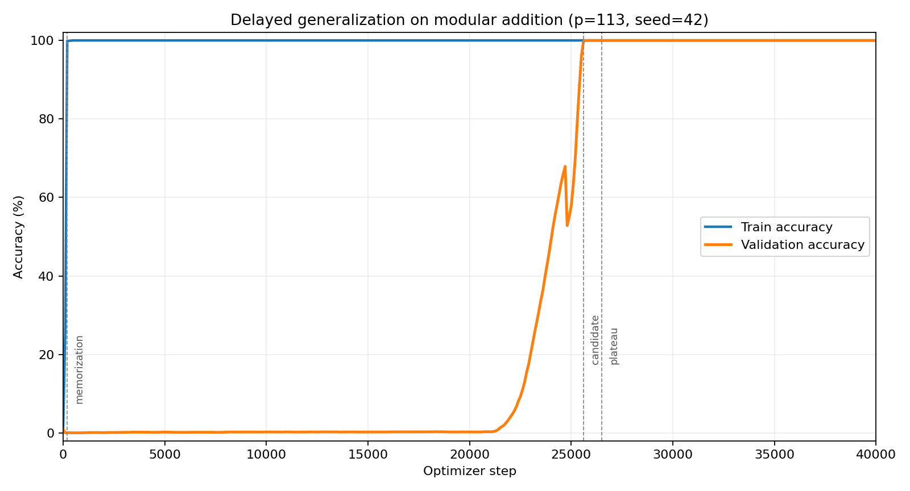

# Grokking Lab

[](https://github.com/IgorRybakoff/grokking-lab/actions/workflows/tests.yml)

**Reproducible PyTorch experiments on delayed generalization in modular addition.**

> **LLM never creates metrics; LLM only interprets measured evidence.**

Grokking Lab is an experimental research package for inspecting the transition from memorization to delayed generalization in small neural networks. Public v0.1 contains an executable PyTorch core, a frozen 40,000-step evidence package, provenance gates, SHA-256 integrity checks, and checkpoint replay.

**Status:** Public v0.1 — experimental  
**Language:** Python >= 3.10 / PyTorch  
**License:** Apache-2.0

## Research question

Can a compact Transformer trained on only 30% of the complete modular-addition table first memorize its training subset and later generalize to the held-out 70% after a long delay?

## What this repository establishes

- a real PyTorch training path performs forward, backward, and AdamW updates;
- the frozen seed 42 run contains 401 measured records from step 0 through 40,000;
- five original PyTorch state-dict checkpoints have verified SHA-256 values;
- checkpoint replay performs new forward passes and matches recorded metrics;
- deterministic threshold checks classify this run as `GROKKING_CONFIRMED`.

It does **not** claim that grokking is universal across seeds, architectures, tasks, optimizers, or scales.

## Experimental setup

| Component | Frozen configuration |
|---|---|
| Task | `(a + b) mod 113` |
| Input | `[a, b, EQUALS]`, context length 3 |
| Split | 30% train / 70% validation |
| Seed | 42 |
| Model | One-layer Transformer, last-token prediction |
| Width | `d_model=128`, 4 heads, `d_mlp=512` |
| Block | Attention residual + ReLU MLP residual |
| Normalization / dropout | None / 0.0 |
| Optimizer | Full-batch AdamW |
| Learning rate / weight decay | 0.001 / 1.0 |
| Training | 40,000 optimizer steps |

## Measured result

| Metric | Frozen value |
|---|---:|
| Final train accuracy | 1.000000 |
| Final validation accuracy | 1.000000 |
| Memorization | step 200 |
| Generalization candidate | step 25,600 |
| Stable plateau | step 26,500 |
| Final train loss | 1.86140596e-6 |
| Final validation loss | 2.59322110e-6 |
| Final weight norm | 39.26596859 |
| Run-level classification | `GROKKING_CONFIRMED` |



The plot is generated directly from the frozen `training_timeseries.json` without smoothing or synthetic points.

## Quick verification

```bash
git clone https://github.com/IgorRybakoff/grokking-lab.git
cd grokking-lab
python3 -m venv .venv
source .venv/bin/activate
python -m pip install -e ".[dev]"
```

### 1. Verify the frozen evidence

```bash
python scripts/verify_artifacts.py
```

Expected high-level result:

```text
status: PASS
experiment_id: exp_1785360132042_p113
timeseries_rows: 401
memorization_step: 200
grokking_candidate_step: 25600
plateau_step: 26500
```

### 2. Replay measured checkpoints

```bash
python scripts/replay_checkpoint.py --checkpoint memorization_model_state.pt
python scripts/replay_checkpoint.py --checkpoint final_model_state.pt
```

Replay loads state dicts with `weights_only=True`, reconstructs the original deterministic split, runs new forward passes, and compares the results with the frozen replay report.

### 3. Run a real PyTorch smoke test

```bash
python scripts/run_smoke.py --output runs/smoke
```

The smoke test performs two full-batch optimizer steps and proves that parameters changed. It does not attempt to reproduce grokking.

### 4. Optional 40k reproduction

```bash
python scripts/run_experiment.py \
  --config configs/p113_seed42_40k.json \
  --output runs/p113_seed42_40k
```

The long run is deliberately excluded from CI.

## Evidence map

| Evidence | Purpose |
|---|---|
| [`config.json`](artifacts/p113_seed42_40k/config.json) | Byte-preserved historical configuration |
| [`experiment_manifest.json`](artifacts/p113_seed42_40k/experiment_manifest.json) | Engine, environment, provenance, completion, checkpoint registry |
| [`training_timeseries.json`](artifacts/p113_seed42_40k/training_timeseries.json) | Measured losses, accuracies, and weight norms |
| [`grokking_event_detection.json`](artifacts/p113_seed42_40k/grokking_event_detection.json) | Recorded milestones and run-level status |
| [`checkpoint_replay_report.json`](artifacts/p113_seed42_40k/checkpoint_replay_report.json) | New-forward-pass replay results |
| [`SHA256SUMS`](artifacts/p113_seed42_40k/SHA256SUMS) | Published package integrity |
| [`artifact_index.json`](artifacts/p113_seed42_40k/artifact_index.json) | Original vs derived vs publication metadata |

The frozen manifest records:

```text
engine_type = pytorch_core
artifact_source = REAL_PYTORCH_RUN
fallback_used = false
simulated_metrics = false
llm_generated_metrics = false
```

## Repository layout

- `src/grokking_lab/` — minimal public training, model, provenance, and replay code;
- `configs/` — CI smoke and optional long-run execution recipes;
- `experiments/` — human-readable experimental protocol;
- `artifacts/` — frozen measured evidence and selected checkpoints;
- `scripts/` — verification, replay, plotting, smoke, and long-run entry points;
- `tests/` — task, architecture, integrity, smoke, and replay checks.

## Reproducibility boundary

The historical run did not preserve a source-code hash or explicit split-index file. Public v0.1 therefore does not claim byte identity with the original internal training script. The public implementation follows the recorded architecture contract, matches the checkpoint state-dict structure exactly, reconstructs the deterministic split, and uses functional checkpoint replay as its compatibility gate.

See [`REPRODUCIBILITY.md`](REPRODUCIBILITY.md) and [`KNOWN_LIMITATIONS.md`](KNOWN_LIMITATIONS.md).

## Citation and license

Citation metadata is available in [`CITATION.cff`](CITATION.cff). The public code is licensed under Apache-2.0. Frozen artifacts are supplied for research verification of the documented experiment.

